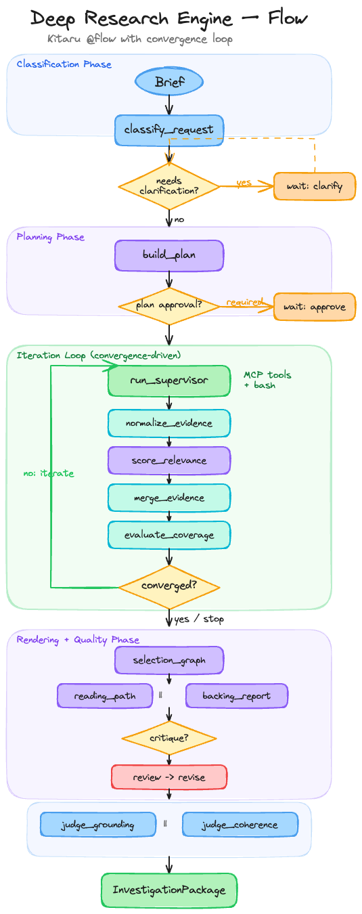

# Deep Research Engine

A production-grade deep research engine built on [Kitaru](https://kitaru.ai) and [PydanticAI](https://ai.pydantic.dev). Plans, iterates, evaluates, and synthesizes research into structured, evidence-backed investigation packages.

Not a search wrapper. Not a report writer. A durable research system with convergence-driven iteration, cross-provider critique, and inspectable provenance at every step.

## What It Does

Given a research brief, the engine:

1. **Classifies** the request (audience, freshness, complexity) and selects a research tier
2. **Plans** the investigation (subtopics, queries, success criteria)
3. **Iterates** through search-evaluate-refine cycles until coverage converges or budget exhausts
4. **Assembles** a canonical `InvestigationPackage` with full evidence provenance
5. **Renders** human-facing outputs (reading paths, backing reports, full reports)
6. **Critiques** renders via cross-provider review (different model evaluates different model's output)
7. **Judges** grounding and coherence with LLM-as-a-judge from a third provider

Every step is a durable Kitaru checkpoint. Runs survive failures, support replay from any boundary, and produce inspectable artifacts at every iteration.

## Architecture

```
Kitaru @flow / @checkpoint              PydanticAI Agent
┌──────────────────────────────┐       ┌─────────────────────────────┐
│ Owns:                        │       │ Owns:                       │
│  - Durable state & replay    │ calls │  - Model call routing       │
│  - Checkpoints & artifacts   │──────>│  - Structured output parse  │
│  - Wait / resume (HITL)      │       │  - Tool execution           │
│  - Convergence enforcement   │<──────│  - Response validation      │
│  - Cost tracking & budgets   │returns│                             │
│  - Stop rules & time boxes   │ typed │ Does NOT own:               │
│                              │result │  - Iteration state          │
│                              │       │  - When to stop             │
│                              │       │  - Checkpointing            │
└──────────────────────────────┘       └─────────────────────────────┘
```

**Why this split:** PydanticAI is a structured completion layer — it calls models and returns typed results. Kitaru is the durable execution layer — it owns checkpoints, waits, replay, and convergence. No competing orchestration layers. The engine's research loop (not an agent SDK) controls iteration.

## The Research Loop




### Stop Rules (checked after every iteration, in priority order)

| Rule | Condition |
|---|---|
| Budget exhausted | `estimated_cost >= cost_budget_usd` |
| Time exhausted | `elapsed_seconds >= time_box_seconds` |
| Converged | `coverage >= min_coverage` AND no remaining gaps |
| Loop stall | Zero coverage gain in an iteration |
| Diminishing returns | Low gain + over 50% resource usage |
| Max iterations | Hard cap reached |

Stop reason is recorded as a machine-readable enum in the run summary.

## Package Structure

The canonical output is an `InvestigationPackage` with six layers:

| Layer | Description |
|---|---|
| **RunSummary** | Run ID, brief, tier, stop reason, cost, timing, provider usage |
| **ResearchPlan** | Goal, subtopics, queries, sections, success criteria |
| **EvidenceLedger** | All candidates: considered, selected, rejected, with dedupe log |
| **SelectionGraph** | Ordered reading items with rationales, bridge notes, gap coverage |
| **IterationTrace** | Per-iteration records: candidates, coverage, cost, tool calls |
| **Renders** | Reading path, backing report (+ optional full report on demand) |

Optional quality layers (deep tier): `CritiqueResult`, `GroundingResult`, `CoherenceResult`.

### Renderers

| Renderer | Timing | Description |
|---|---|---|
| `reading_path` | Eager | Ordered resources with per-item rationale and subtopic coverage |
| `backing_report` | Eager | Evidence selection rationale, gap analysis — the "show your work" artifact |
| `full_report` | Lazy | Full cited synthesis, produced on first request then cached |

## Tiers

| Tier | Max Iterations | Cost Budget | Time Box | Critique | Judge | Council |
|---|---|---|---|---|---|---|
| Quick | 2 | $0.05 | 2 min | No | No | No |
| Standard | 3 | $0.10 | 10 min | No | No | No |
| Deep | 6 | $1.00 | 30 min | Yes | Yes | Available |
| Custom | Configurable | Configurable | Configurable | Configurable | Configurable | Available |

When `tier = "auto"`, the classifier detects complexity from the brief and selects automatically.

### Council Mode (Opt-In)

N parallel generators (default: 3) each execute independent search turns. An aggregator merges their evidence ledgers (union candidates, best-score-wins dedup, union matched subtopics). Available on deep and custom tiers. Approximately 15x more tokens than single-agent — use for high-stakes research where breadth matters more than cost.

## Project Layout

```
deep_research/
├── agents/                  # PydanticAI agent factories (Kitaru-wrapped)
│   ├── supervisor.py        #   Search supervisor with MCP tools + bash
│   ├── classifier.py        #   Request classification
│   ├── planner.py           #   Research plan generation
│   ├── relevance_scorer.py  #   Evidence relevance scoring
│   ├── reviewer.py          #   Cross-provider critique
│   ├── judge.py             #   Grounding + coherence judges
│   ├── writer.py            #   Report composition
│   ├── curator.py           #   Evidence curation
│   └── aggregator.py        #   Council result aggregation
├── checkpoints/             # Kitaru checkpoint functions
│   ├── classify.py          #   @checkpoint(type="llm_call")
│   ├── plan.py              #   @checkpoint(type="llm_call")
│   ├── supervisor.py        #   @checkpoint(type="llm_call") — search turn
│   ├── council.py           #   @checkpoint(type="llm_call") — parallel generators
│   ├── normalize.py         #   @checkpoint(type="tool_call")
│   ├── relevance.py         #   @checkpoint(type="llm_call")
│   ├── merge.py             #   @checkpoint(type="tool_call")
│   ├── evaluate.py          #   @checkpoint(type="tool_call") — coverage scoring
│   ├── select.py            #   @checkpoint(type="tool_call") — selection graph
│   ├── rendering.py         #   reading_path, backing_report, full_report
│   ├── review.py            #   @checkpoint(type="llm_call") — critique
│   ├── revise.py            #   @checkpoint(type="llm_call")
│   ├── grounding.py         #   @checkpoint(type="llm_call") — LLM judge
│   ├── coherence.py         #   @checkpoint(type="llm_call") — LLM judge
│   └── assemble.py          #   @checkpoint(type="tool_call") — final package
├── evidence/                # Evidence processing (no LLM calls)
│   ├── dedup.py             #   DOI > arXiv > URL > title precedence
│   ├── ledger.py            #   Ratchet merge (scores only go up)
│   ├── scoring.py           #   Heuristic quality by source kind
│   ├── url.py               #   URL canonicalization
│   └── resolution.py        #   Selected/coverage entry resolution
├── flow/
│   ├── research_flow.py     #   @flow — top-level orchestration
│   ├── convergence.py       #   Stop decision logic
│   └── costing.py           #   Token → USD estimation
├── models.py                # All Pydantic models (strict, immutable)
├── config.py                # ResearchConfig, tier defaults, env settings
├── enums.py                 # StopReason, Tier, SourceKind
├── providers/
│   ├── __init__.py          #   build_supervisor_surface (tools + MCP toolsets)
│   ├── mcp_config.py        #   MCPServerConfig + toolset factory
│   └── normalization.py     #   Raw tool results → EvidenceCandidate
├── renderers/               # Pure functions: package data → markdown + structured
│   ├── reading_path.py
│   ├── backing_report.py
│   └── full_report.py
├── tools/
│   ├── bash_executor.py     #   Allow-listed bash sandbox (echo, ls, pwd)
│   └── state_reader.py      #   read_plan, read_gaps tools for supervisor
├── package/
│   ├── assembly.py          #   InvestigationPackage construction
│   └── io.py                #   write_package / read_package (JSON + markdown)
├── prompts/                 #   System prompts as markdown files
│   ├── supervisor.md
│   ├── planner.md
│   ├── classifier.md
│   ├── reviewer.md
│   ├── writer.md
│   ├── judge_grounding.md
│   ├── judge_coherence.md
│   ├── relevance_scorer.md
│   ├── curator.md
│   ├── aggregator.md
│   └── question_generator.md
└── critique/
    └── __init__.py          #   Re-exports critique models
```

## How It Works

### Agents

Every agent is a PydanticAI `Agent` wrapped with `kitaru.adapters.pydantic_ai.wrap()` for automatic observability. Each agent:

- Has a typed `output_type` (Pydantic model) — structured output, not free text
- Loads its system prompt from `prompts/<name>.md`
- Is instantiated fresh per checkpoint call (no shared state between runs)
- Uses `instructions=` (current PydanticAI API) for system prompts

```python
from kitaru.adapters import pydantic_ai as kp
from pydantic_ai import Agent

def build_planner_agent(model_name: str):
    return kp.wrap(
        Agent(
            model_name,
            name="planner",
            output_type=ResearchPlan,
            instructions=load_prompt("planner"),
        )
    )
```

The supervisor agent is special — it receives MCP toolsets and local tools (read_plan, read_gaps, run_bash) for search execution:

```python
def build_supervisor_agent(model_name, toolsets, tools):
    return kp.wrap(
        Agent(
            model_name,
            name="supervisor",
            output_type=SupervisorCheckpointResult,
            instructions=load_prompt("supervisor"),
            toolsets=toolsets,
            tools=tools,
        ),
        tool_capture_config={"mode": "full"},
    )
```

### Checkpoints

Every checkpoint is a `@checkpoint`-decorated function that calls one agent or performs one deterministic operation:

```python
from kitaru import checkpoint

@checkpoint(type="llm_call")
def score_relevance(candidates, plan, config) -> RelevanceCheckpointResult:
    agent = build_relevance_scorer_agent(config.relevance_scorer_model)
    prompt = {"plan": plan.model_dump(mode="json"), "candidates": [...]}
    return agent.run_sync(json.dumps(prompt, indent=2)).output
```

Checkpoint types: `"llm_call"` (involves a model call) or `"tool_call"` (deterministic logic). This distinction drives Kitaru dashboard visualization.

### Evidence Pipeline

Evidence flows through a strict pipeline:

1. **Raw tool results** (`RawToolResult`) — provider-specific payloads
2. **Normalization** — `normalize_tool_results()` converts to `EvidenceCandidate` with canonical URLs, deterministic keys (SHA256 of DOI/arXiv/URL), and normalized scores
3. **Relevance scoring** — LLM scores each candidate against the research plan
4. **Merge** — `merge_candidates()` ratchet-merges into the ledger (scores only go up, snippets accumulate, dedup by DOI > arXiv > URL > title)
5. **Selection** — Quality floor filter (default 0.3), then deterministic ordering by quality + authority + relevance

The ratchet rule guarantees that the engine never loses good evidence from earlier iterations.

### Convergence

Coverage score is the unweighted mean of three heuristics:

- **Subtopic coverage**: proportion of plan subtopics with at least one matched source
- **Source diversity**: proportion of distinct providers with results (capped at 3)
- **Evidence density**: ratio of candidates to key questions

The engine stops when `coverage >= min_coverage` with no remaining gaps, or when marginal improvement drops below epsilon under resource pressure.

### Cross-Provider Quality Checks

The critique and judge layers enforce quality through model diversity:

- **Critique** (deep tier): A reviewer model (default: Claude Sonnet) critiques renders produced by the generator (default: Gemini Flash). The reviewer scores dimensions and suggests revisions. The generator revises. The reviewer never rewrites directly.
- **Grounding judge**: Verifies that citations actually support claims. Different provider than the generator.
- **Coherence judge**: Scores relevance, logical flow, completeness, and consistency against the plan.

This follows the Microsoft Critique finding: separating generation from evaluation across model providers achieves statistically significant quality improvements.

### Wait Points (Human-in-the-Loop)

The engine supports two Kitaru `wait()` points:

| Wait | Trigger | User Action |
|---|---|---|
| `clarify_brief` | Brief is ambiguous | Provide clarified brief |
| `approve_plan` | `require_plan_approval = true` | Approve or reject the plan |

Wait behavior is tier-dependent. Quick tier skips all waits.

### Package Persistence

`write_package()` serializes an `InvestigationPackage` to disk:

```
output_dir/
└── run-<uuid>/
    ├── package.json          # Full serialized package
    ├── summary.md            # Human-readable run summary
    ├── plan.json             # Structured research plan
    ├── plan.md               # Readable plan companion
    ├── evidence/
    │   ├── ledger.json       # Full evidence ledger
    │   └── ledger.md         # Readable evidence index
    ├── iterations/
    │   ├── 000.json          # Per-iteration records
    │   ├── 001.json
    │   └── ...
    └── renders/
        ├── reading_path.md
        └── backing_report.md
```

`read_package()` loads it back. `write_full_report()` generates the lazy full report on demand.

## Configuration

### LLM Model Assignment

All LLM calls route through PydanticAI. Model strings use `provider/model-name` format. Changing a model is a config change, not a code change.

| Setting | Default | Role |
|---|---|---|
| `classifier_model` | `gemini/gemini-2.0-flash-lite` | Request classification |
| `planner_model` | `gemini/gemini-2.5-flash` | Plan generation |
| `supervisor_model` | `gemini/gemini-2.5-flash` | Research cycle supervisor |
| `relevance_scorer_model` | `gemini/gemini-2.5-flash` | Evidence relevance scoring |
| `curator_model` | `gemini/gemini-2.0-flash-lite` | Reading path curation |
| `writer_model` | `gemini/gemini-2.5-flash` | Report composition |
| `aggregator_model` | `openai/gpt-4o-mini` | Council evidence aggregation |
| `review_model` | `anthropic/claude-sonnet-4-20250514` | Cross-provider critique |
| `judge_model` | `openai/gpt-4o-mini` | Grounding + coherence judges |

### Engine Settings (Environment Variables)

All settings use the `RESEARCH_` prefix and are loaded via Pydantic Settings.

| Variable | Default | Description |
|---|---|---|
| `RESEARCH_DEFAULT_TIER` | `standard` | Default when tier not specified |
| `RESEARCH_DEFAULT_MAX_ITERATIONS` | `3` | Default iteration limit |
| `RESEARCH_DEFAULT_COST_BUDGET_USD` | `0.10` | Default cost ceiling |
| `RESEARCH_DAILY_COST_LIMIT_USD` | `10.00` | Global daily ceiling |
| `RESEARCH_CONVERGENCE_EPSILON` | `0.05` | Minimum coverage delta to continue |
| `RESEARCH_CONVERGENCE_MIN_COVERAGE` | `0.60` | Minimum acceptable coverage |
| `RESEARCH_MAX_TOOL_CALLS_PER_CYCLE` | `5` | Max tool calls per iteration |
| `RESEARCH_TOOL_TIMEOUT_SEC` | `20` | Per-tool-call timeout |
| `RESEARCH_SOURCE_QUALITY_FLOOR` | `0.30` | Minimum quality for selection |
| `RESEARCH_COUNCIL_SIZE` | `3` | Parallel generators in council mode |
| `RESEARCH_COUNCIL_COST_BUDGET_USD` | `2.00` | Council cost budget |

### Provider API Keys

PydanticAI reads keys from standard environment variables. At least one must be configured.

| Provider | Variable |
|---|---|
| Google (Gemini) | `GEMINI_API_KEY` |
| Anthropic (Claude) | `ANTHROPIC_API_KEY` |
| OpenAI (GPT) | `OPENAI_API_KEY` |

Search providers are plugged in via MCP server configurations. The engine is fully functional with zero external search keys — the supervisor can use its bash sandbox and any configured MCP servers.

## Installation

```bash
# Clone and install
git clone https://github.com/zenml-io/deep-research.git
cd deep-research
uv sync

# Set at least one LLM provider key
export GEMINI_API_KEY="..."

# Run tests
uv run pytest tests/
```

### Requirements

- Python 3.11+
- [Kitaru](https://kitaru.ai) — durable execution
- [PydanticAI](https://ai.pydantic.dev) — structured LLM completions
- Pydantic v2 + pydantic-settings

## Testing

The test suite covers models, evidence pipeline, convergence logic, checkpoints, renderers, agent factories, flow orchestration, and real agent behavior with PydanticAI's `TestModel`:

```bash
uv run pytest tests/ -v
```

Key test patterns:

- **Model validation**: Round-trip serialization, field constraints, cross-field invariants
- **Evidence pipeline**: Normalization, dedup (DOI/arXiv/URL/title), ratchet merge, quality floor
- **Convergence**: All stop reasons, coverage thresholds, resource pressure
- **Checkpoints**: Stubbed Kitaru decorators, agent factory mocking, config propagation
- **Flow**: Full orchestration with council and clarification paths
- **Agent behavior**: PydanticAI `TestModel` for structured output parsing

## Design Principles

**Library-first.** The engine is a Python library. No FastAPI, no CLI for v1. The `@flow` is the entry point.

**Package-canonical.** The `InvestigationPackage` is the canonical output. Reports and reading paths are rendered views derived from it. Different consumers get different surfaces from the same package.

**Immutable evidence.** Pydantic models use `extra="forbid"` and `model_copy(update=...)` throughout. The ratchet rule ensures evidence only accumulates — scores go up, snippets merge, nothing is lost.

**Prompts as markdown.** System prompts live in `prompts/*.md`, loaded at agent construction time. Prompt changes don't require code changes.

**Durable everything.** Every major phase boundary is a Kitaru checkpoint. Runs survive process crashes, support replay from any checkpoint, and produce inspectable artifacts at every iteration.

**Cross-provider critique.** The reviewer and judges use different providers than the generators. Self-evaluation is unreliable — the engine enforces model diversity for quality checks.

## License

See [LICENSE](LICENSE) for details.
