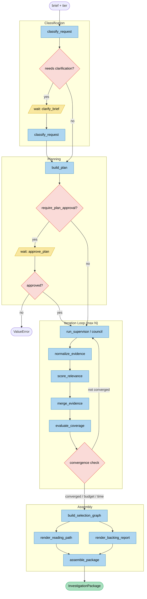
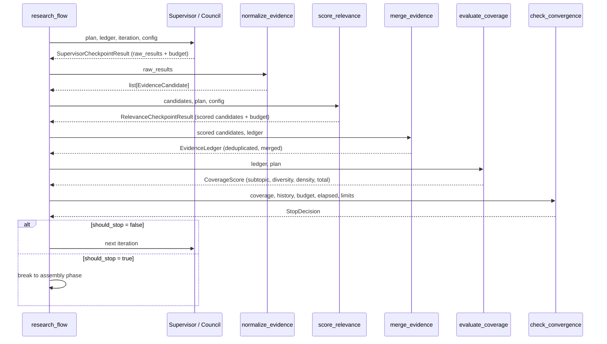
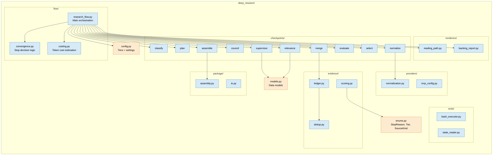
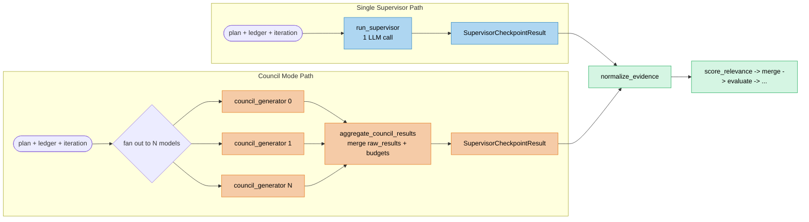
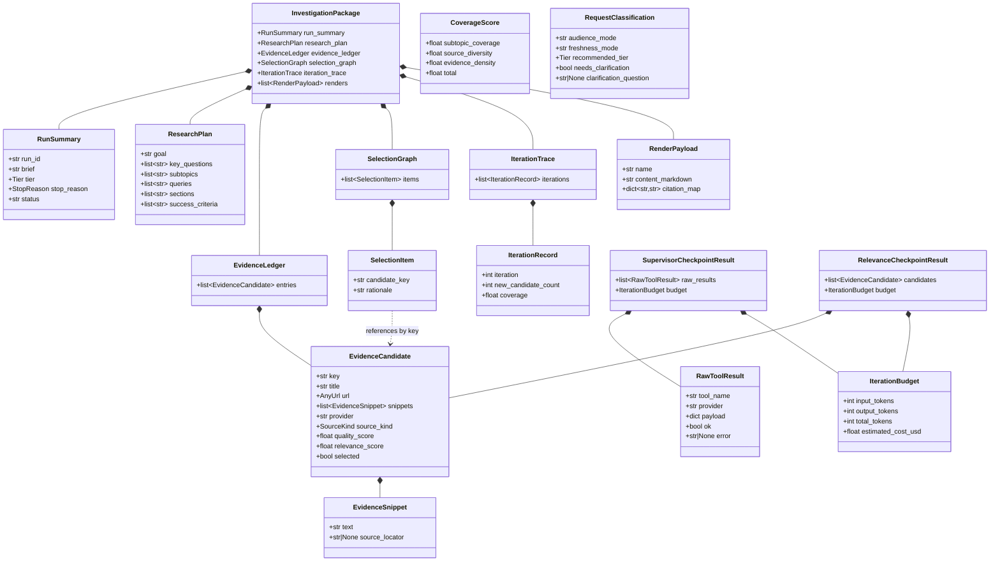

# Deep Research Engine Architecture

This document describes the architecture of the deep-research engine -- a Kitaru-based durable workflow that iteratively gathers, scores, and curates evidence to answer a research brief.

---

## 1. High-Level Research Flow

The research flow proceeds through four logical phases: classification of the incoming brief, planning, an iterative search-and-evaluate loop, and final assembly of the investigation package. Two optional wait points allow human-in-the-loop control: one for clarifying ambiguous briefs and one for approving the generated plan.

---

## 2. Checkpoint Dependency Graph

Each checkpoint is a Kitaru-decorated function whose outputs feed into subsequent checkpoints. The main path is sequential, but the council fan-out runs N generators concurrently, and the two renderers execute in parallel after selection.

```mermaid
flowchart LR
    classDef llm fill:#aed6f1,stroke:#2e86c1,color:#000
    classDef tool fill:#d5f5e3,stroke:#27ae60,color:#000
    classDef fan fill:#f5cba7,stroke:#e67e22,color:#000

    classify[classify_request<br/>LLM]:::llm
    plan[build_plan<br/>LLM]:::llm
    sup[run_supervisor<br/>LLM]:::llm
    cg0[council_generator 0<br/>LLM]:::fan
    cg1[council_generator 1<br/>LLM]:::fan
    cgN[council_generator N<br/>LLM]:::fan
    agg[aggregate_council_results]:::tool
    norm[normalize_evidence<br/>tool]:::tool
    rel[score_relevance<br/>LLM]:::llm
    mrg[merge_evidence<br/>tool]:::tool
    eval[evaluate_coverage<br/>tool]:::tool
    sel[build_selection_graph<br/>LLM]:::llm
    rp[render_reading_path<br/>LLM]:::llm
    rb[render_backing_report<br/>LLM]:::llm
    asm[assemble_package<br/>tool]:::tool

    classify -- RequestClassification --> plan
    plan -- ResearchPlan --> sup
    plan -- ResearchPlan --> cg0
    plan -- ResearchPlan --> cg1
    plan -- ResearchPlan --> cgN

    sup -- SupervisorCheckpointResult --> norm
    cg0 -- SupervisorCheckpointResult --> agg
    cg1 -- SupervisorCheckpointResult --> agg
    cgN -- SupervisorCheckpointResult --> agg
    agg -- SupervisorCheckpointResult --> norm

    norm -- "list[EvidenceCandidate]" --> rel
    rel -- RelevanceCheckpointResult --> mrg
    mrg -- EvidenceLedger --> eval
    eval -- CoverageScore --> sel

    sel -- SelectionGraph --> rp
    sel -- SelectionGraph --> rb
    rp -- RenderPayload --> asm
    rb -- RenderPayload --> asm
```

---

## 3. Iteration Loop Detail

Each iteration cycle follows a strict sequence: the supervisor (or council) searches for evidence, results are normalized into candidates, scored for relevance, merged into the running ledger, and coverage is evaluated. The convergence check then decides whether to continue or stop.

---

## 4. Module Structure

The codebase is organized into focused packages. The `flow/` package orchestrates the research loop and convergence logic. `checkpoints/` contains the Kitaru-decorated checkpoint functions. Supporting concerns are separated into `evidence/`, `providers/`, `tools/`, `renderers/`, and `package/`.

---

## 5. Council Mode vs Single Supervisor

In single-supervisor mode, one LLM call searches for evidence per iteration. In council mode, N generators (each potentially using different models) run concurrently, and their results are aggregated before normalization. Council mode trades higher cost for broader evidence coverage.

---

## 6. Data Model Relationships

The core data models form a hierarchy rooted in `InvestigationPackage`, which is the final output. The iteration loop populates the `EvidenceLedger` with `EvidenceCandidate` entries, while `SelectionGraph` curates the final set. `RunSummary` and `IterationTrace` capture execution metadata.

---

## Convergence Stop Reasons

The convergence check in `flow/convergence.py` evaluates multiple stopping conditions in priority order:

| StopReason | Trigger |
|---|---|
| `BUDGET_EXHAUSTED` | Cumulative cost reaches `cost_budget_usd` |
| `TIME_EXHAUSTED` | Wall-clock time reaches `time_box_seconds` |
| `CONVERGED` | Coverage total meets `convergence_min_coverage` |
| `LOOP_STALL` | Coverage gain is zero or negative |
| `DIMINISHING_RETURNS` | Coverage gain falls below `convergence_epsilon` |
| `MAX_ITERATIONS` | Iteration count reaches `max_iterations` |

## Tier Configuration

| Tier | Max Iterations | Budget (USD) | Time Box (s) | Critique | Judge | Council |
|---|---|---|---|---|---|---|
| `quick` | 2 | 0.05 | 120 | no | no | no |
| `standard` | 3 | 0.10 | 600 | no | no | no |
| `deep` | 6 | 1.00 | 1800 | yes | yes | yes |
| `custom` | 3 | 0.10 | 600 | no | no | yes |
