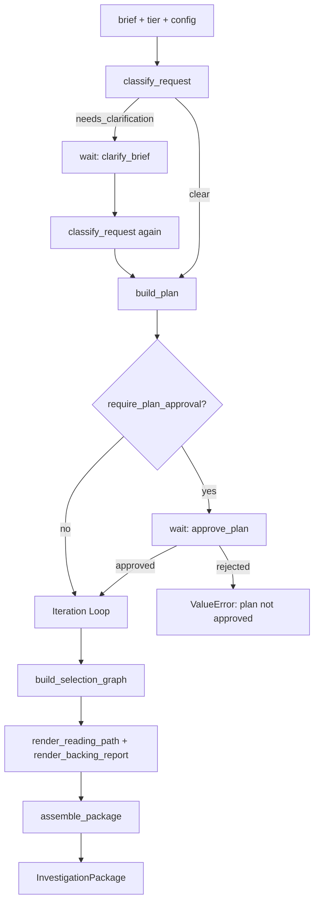
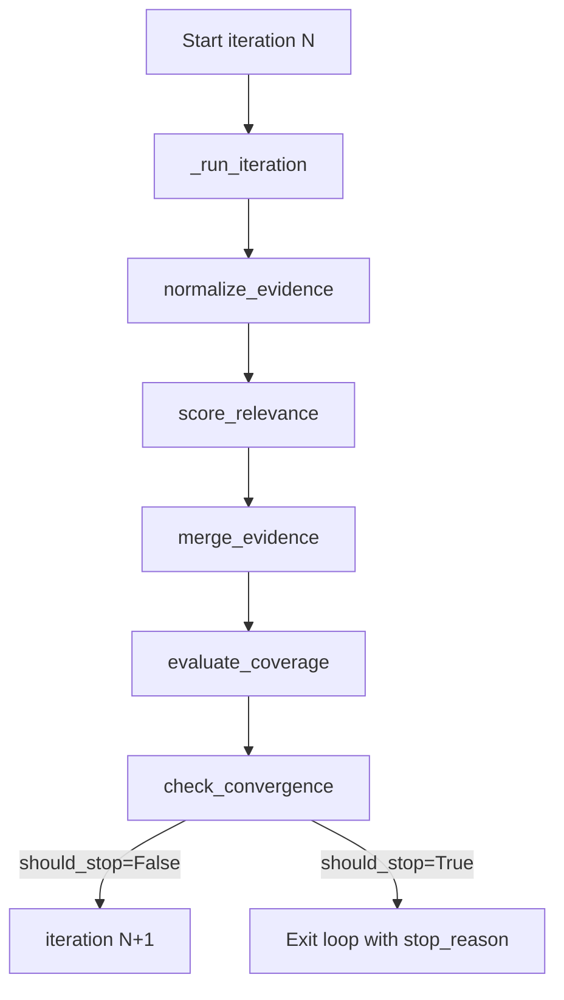
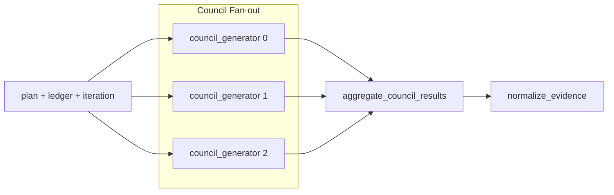
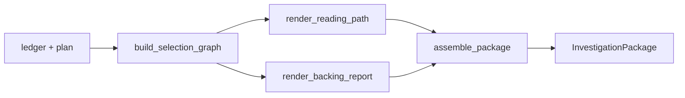

# Research Flow Architecture

## Overview

The research flow is a Kitaru durable workflow that takes a natural-language research brief and produces an `InvestigationPackage` -- a structured bundle of curated evidence, rendered reports, and metadata. The flow classifies the request, builds a research plan, iteratively gathers and scores evidence until a convergence condition is met, then selects the best evidence and renders output documents.

The entire flow is defined in `deep_research/flow/research_flow.py` as a single `@flow`-decorated function. Each meaningful step is a Kitaru `@checkpoint`, making every intermediate result durable, replayable, and observable.

---

## Flow Lifecycle



### Step-by-step

1. **Classify** -- `classify_request` determines the audience mode, freshness mode, recommended tier, and whether the brief needs clarification.
2. **Clarify (conditional)** -- If `needs_clarification` is true, the flow pauses at the `clarify_brief` wait point. The operator provides a revised brief, and classification reruns.
3. **Resolve config** -- The tier (auto-detected or explicit) is used to build a `ResearchConfig` via `ResearchConfig.for_tier()`. Any caller-supplied config overrides are merged.
4. **Plan** -- `build_plan` generates a `ResearchPlan` with goal, key questions, subtopics, queries, sections, and success criteria.
5. **Approve (conditional)** -- If `require_plan_approval` is true (default), the flow pauses at `approve_plan`. The operator confirms or rejects.
6. **Iterate** -- The core research loop runs up to `max_iterations` times. Each iteration: supervisor generates evidence, normalize, score relevance, merge into ledger, evaluate coverage, check convergence.
7. **Select** -- `build_selection_graph` curates the best evidence from the ledger.
8. **Render** -- Two renders execute concurrently: `render_reading_path` and `render_backing_report`.
9. **Assemble** -- All artifacts are bundled into an `InvestigationPackage`.

---

## Checkpoints

Every checkpoint is decorated with `@checkpoint(type=...)` from Kitaru. The `type` indicates whether the step calls an LLM or performs deterministic computation.

| Checkpoint | Type | Module | Inputs | Output | Purpose |
|---|---|---|---|---|---|
| `classify_request` | `llm_call` | `checkpoints/classify.py` | `brief`, `config` | `RequestClassification` | Determine tier, audience, freshness; flag ambiguous briefs |
| `build_plan` | `llm_call` | `checkpoints/plan.py` | `brief`, `classification`, `tier` | `ResearchPlan` | Generate structured research plan with questions and subtopics |
| `run_supervisor` | `llm_call` | `checkpoints/supervisor.py` | `plan`, `ledger`, `iteration`, `config` | `SupervisorCheckpointResult` | Execute one research iteration via tool-calling agent |
| `run_council_generator` | `llm_call` | `checkpoints/council.py` | `plan`, `ledger`, `iteration`, `model_name`, `config` | `SupervisorCheckpointResult` | Single council member's research iteration |
| `normalize_evidence` | `tool_call` | `checkpoints/normalize.py` | `raw_results: list[RawToolResult]` | `list[EvidenceCandidate]` | Parse raw tool outputs into uniform candidates with keys |
| `score_relevance` | `llm_call` | `checkpoints/relevance.py` | `candidates`, `plan`, `config` | `RelevanceCheckpointResult` | LLM scores each candidate's relevance to the plan |
| `merge_evidence` | `tool_call` | `checkpoints/merge.py` | `scored`, `ledger` | `EvidenceLedger` | Deduplicate and merge scored candidates into the ledger |
| `evaluate_coverage` | `tool_call` | `checkpoints/evaluate.py` | `ledger`, `plan` | `CoverageScore` | Compute subtopic coverage, source diversity, evidence density |
| `build_selection_graph` | `llm_call` | `checkpoints/select.py` | `ledger`, `plan`, `config` | `SelectionGraph` | Curate final evidence set with rationales |
| `render_reading_path` | `llm_call` | `renderers/reading_path.py` | `selection` | `RenderPayload` | Generate ordered reading path markdown |
| `render_backing_report` | `llm_call` | `renderers/backing_report.py` | `selection`, `ledger`, `plan` | `RenderPayload` | Generate backing report with citations |
| `assemble_package` | `tool_call` | `checkpoints/assemble.py` | `run_summary`, `research_plan`, `evidence_ledger`, `selection_graph`, `iteration_trace`, `renders` | `InvestigationPackage` | Bundle all artifacts into final output |

---

## Wait Points

The flow has two operator-facing wait points, implemented via Kitaru's `wait()` primitive. When a wait triggers, the flow suspends and persists its state. An external operator (human or system) must provide the expected input to resume.

| Wait Name | Schema | Trigger Condition | Expected Input | Effect |
|---|---|---|---|---|
| `clarify_brief` | `str` | `classification.needs_clarification is True` | A revised or clarified research brief (string) | Replaces the original `brief`; classification reruns with the new text |
| `approve_plan` | `bool` | `config.require_plan_approval is True` (default) | `True` to approve, `False` to reject | If `False`, the flow raises `ValueError("plan not approved")` and terminates |

Wait point names are stable constants defined at module level:

```python
CLARIFY_BRIEF_WAIT_NAME = "clarify_brief"
APPROVE_PLAN_WAIT_NAME = "approve_plan"
```

---

## Iteration Loop

The core research loop runs inside `for iteration in range(config.max_iterations)`:



### Per-iteration detail

1. **Supervisor / Council** -- `_run_iteration()` dispatches to either a single `run_supervisor` or fans out to `council_size` concurrent `run_council_generator` calls, then aggregates. Returns `SupervisorCheckpointResult` containing `raw_results` and `budget`.
2. **Normalize** -- `normalize_evidence` converts `RawToolResult` payloads into `EvidenceCandidate` objects. Each candidate gets a deterministic key from `sha256(provider:url)`.
3. **Score relevance** -- `score_relevance` uses an LLM to assign `relevance_score` to each candidate against the plan.
4. **Merge** -- `merge_evidence` deduplicates by key and merges scored candidates into the cumulative `EvidenceLedger`.
5. **Evaluate** -- `evaluate_coverage` computes a `CoverageScore` with three dimensions:
   - `subtopic_coverage` -- fraction of plan subtopics mentioned in evidence text
   - `source_diversity` -- number of distinct providers / 3, capped at 1.0
   - `evidence_density` -- number of entries / number of key questions, capped at 1.0
   - `total` -- arithmetic mean of the three, rounded to 4 decimals
6. **Convergence check** -- Pure function (not a checkpoint) that evaluates stop conditions. See [Convergence Logic](#convergence-logic).
7. **Log** -- `kitaru.log()` emits iteration number, coverage total, and spent USD.

The `EvidenceLedger` is reassigned each iteration (immutable pattern -- `merge_evidence` returns a new ledger).

---

## Council Mode

When `config.council_mode` is `True`, the iteration step fans out to multiple concurrent generators instead of a single supervisor.



### How it works

1. `council_models` is a list of `config.council_size` copies of `config.supervisor_model`.
2. Each generator is submitted concurrently via `.submit()` with a unique `id=f"council_{index}"`.
3. `aggregate_council_results` merges all `raw_results` lists and sums `IterationBudget` values via `merge_usage`.
4. The aggregated `SupervisorCheckpointResult` feeds into the same normalize/score/merge pipeline as single-supervisor mode.

Council mode is allowed only for `DEEP` and `CUSTOM` tiers (controlled by `TierConfig.allows_council`). `council_size` defaults to 3 from `ResearchSettings`.

---

## Convergence Logic

Convergence is checked after every iteration by `check_convergence()` in `deep_research/flow/convergence.py`. It returns a `StopDecision(should_stop, reason)`.

Stop conditions are evaluated in priority order:

| Priority | Condition | StopReason | Description |
|---|---|---|---|
| 1 | `spent_usd >= budget_limit_usd` | `BUDGET_EXHAUSTED` | Cost ceiling reached |
| 2 | `elapsed_seconds >= time_limit_seconds` | `TIME_EXHAUSTED` | Time box exceeded |
| 3 | `current.total >= min_coverage` | `CONVERGED` | Coverage target met |
| 4 | `coverage_gain <= 0` | `LOOP_STALL` | No improvement over previous iteration |
| 5 | `coverage_gain < epsilon` | `DIMINISHING_RETURNS` | Improvement below epsilon threshold |
| 6 | `len(history) + 1 >= max_iterations` | `MAX_ITERATIONS` | Iteration cap reached |

If none trigger, `should_stop=False` and the loop continues.

Note: the `history` passed to `check_convergence` is `iteration_history[:-1]` -- it excludes the current iteration so that conditions 4 and 5 compare against the *previous* iteration's coverage.

### StopReason enum

```python
class StopReason(str, Enum):
    CONVERGED = "converged"
    DIMINISHING_RETURNS = "diminishing_returns"
    BUDGET_EXHAUSTED = "budget_exhausted"
    TIME_EXHAUSTED = "time_exhausted"
    MAX_ITERATIONS = "max_iterations"
    LOOP_STALL = "loop_stall"
    CANCELLED = "cancelled"
```

---

## Tier System

The `Tier` enum defines four tiers. Each tier maps to a `TierConfig` that controls iteration limits, budgets, and feature gates.

| Field | QUICK | STANDARD | DEEP | CUSTOM |
|---|---|---|---|---|
| `max_iterations` | 2 | 3 (default) | 6 | 3 (default) |
| `cost_budget_usd` | $0.05 | $0.10 (default) | $1.00 | $0.10 (default) |
| `time_box_seconds` | 120 (2 min) | 600 (10 min) | 1800 (30 min) | 600 (10 min) |
| `critique_enabled` | No | No | Yes | No |
| `judge_enabled` | No | No | Yes | No |
| `allows_council` | No | No | Yes | Yes |
| `requires_plan_approval` | Yes | Yes | Yes | Yes |
| `council_size` | 1 | 1 | 3 (from settings) | 3 (from settings) |

### Tier resolution

1. If `tier="auto"` (default), the classifier's `recommended_tier` is used.
2. Otherwise, the explicit tier string is cast to `Tier(tier)`.
3. `_resolve_runtime_config` builds a base config from the tier, then overlays any caller-supplied config overrides.

### Model assignments (defaults from ResearchSettings)

| Role | Default Model |
|---|---|
| `classifier_model` | `gemini/gemini-2.0-flash-lite` |
| `planner_model` | `gemini/gemini-2.5-flash` |
| `supervisor_model` | `gemini/gemini-2.5-flash` |
| `relevance_scorer_model` | `gemini/gemini-2.5-flash` |
| `curator_model` | `gemini/gemini-2.0-flash-lite` |
| `writer_model` | `gemini/gemini-2.5-flash` |
| `aggregator_model` | `openai/gpt-4o-mini` |

---

## Replay Anchors

Kitaru replay requires stable checkpoint names. The following names are constants in `research_flow.py` and must not be renamed without a migration:

| Constant | Value | Used By |
|---|---|---|
| `CLASSIFY_CHECKPOINT_NAME` | `"classify_request"` | `classify_request` checkpoint |
| `PLAN_CHECKPOINT_NAME` | `"build_plan"` | `build_plan` checkpoint |
| `SUPERVISOR_CHECKPOINT_NAME` | `"run_supervisor"` | `run_supervisor` checkpoint |
| `COUNCIL_GENERATOR_CHECKPOINT_NAME` | `"run_council_generator"` | `run_council_generator` checkpoint |
| `APPROVE_PLAN_WAIT_NAME` | `"approve_plan"` | Plan approval wait point |
| `CLARIFY_BRIEF_WAIT_NAME` | `"clarify_brief"` | Brief clarification wait point |

Additional stable checkpoint names (derived from function names via `@checkpoint`):

- `normalize_evidence`
- `score_relevance`
- `merge_evidence`
- `evaluate_coverage`
- `build_selection_graph`
- `render_reading_path`
- `render_backing_report`
- `assemble_package`

Council generators use dynamic IDs: `f"council_{index}"` for each fan-out member.

---

## Terminal Section

After the iteration loop exits, the flow enters the terminal section: selection, rendering, and assembly.



### Selection

`build_selection_graph` uses the curator LLM to pick the most relevant evidence from the ledger. It returns a `SelectionGraph` containing `SelectionItem` entries, each with a `candidate_key` and `rationale`.

### Concurrent rendering

Two renderers are submitted concurrently via `.submit()`:

- **`render_reading_path`** -- Produces an ordered reading guide from the selected items.
- **`render_backing_report`** -- Produces a detailed backing report with the plan goal and selection count.

Both return `RenderPayload(name, content_markdown, citation_map)`.

### Assembly

`assemble_package` bundles everything into the final `InvestigationPackage`:

```python
InvestigationPackage(
    run_summary: RunSummary,       # run_id, brief, tier, stop_reason, status
    research_plan: ResearchPlan,   # goal, key_questions, subtopics, queries, sections
    evidence_ledger: EvidenceLedger,  # all accumulated candidates
    selection_graph: SelectionGraph,  # curated subset with rationales
    iteration_trace: IterationTrace,  # per-iteration metrics
    renders: list[RenderPayload],    # reading_path + backing_report
)
```

---

## Configuration

### ResearchConfig fields

| Field | Type | Default | Description |
|---|---|---|---|
| `tier` | `Tier` | -- | Active tier (set by resolution logic) |
| `max_iterations` | `int` | Tier-dependent | Maximum research loop iterations |
| `cost_budget_usd` | `float` | Tier-dependent | Maximum spend before `BUDGET_EXHAUSTED` |
| `time_box_seconds` | `int` | Tier-dependent | Maximum wall-clock seconds before `TIME_EXHAUSTED` |
| `critique_enabled` | `bool` | `False` | Enable critique step (DEEP only) |
| `judge_enabled` | `bool` | `False` | Enable judge step (DEEP only) |
| `council_mode` | `bool` | `False` | Fan out to multiple generators per iteration |
| `council_size` | `int` | 1 or 3 | Number of concurrent council generators |
| `require_plan_approval` | `bool` | `True` | Whether to pause at the `approve_plan` wait point |
| `convergence_epsilon` | `float` | `0.05` | Minimum coverage gain to avoid `DIMINISHING_RETURNS` |
| `convergence_min_coverage` | `float` | `0.60` | Coverage threshold for `CONVERGED` stop |
| `classifier_model` | `str` | `gemini/gemini-2.0-flash-lite` | Model for brief classification |
| `planner_model` | `str` | `gemini/gemini-2.5-flash` | Model for plan generation |
| `supervisor_model` | `str` | `gemini/gemini-2.5-flash` | Model for research iterations |
| `relevance_scorer_model` | `str` | `gemini/gemini-2.5-flash` | Model for relevance scoring |
| `curator_model` | `str` | `gemini/gemini-2.0-flash-lite` | Model for evidence selection |
| `writer_model` | `str` | `gemini/gemini-2.5-flash` | Model for report writing |
| `aggregator_model` | `str` | `openai/gpt-4o-mini` | Model for council aggregation |

### ResearchSettings (environment)

All settings can be overridden via environment variables with the `RESEARCH_` prefix (e.g., `RESEARCH_DEFAULT_TIER=deep`).

| Setting | Env Var | Default |
|---|---|---|
| `default_tier` | `RESEARCH_DEFAULT_TIER` | `standard` |
| `default_max_iterations` | `RESEARCH_DEFAULT_MAX_ITERATIONS` | `3` |
| `default_cost_budget_usd` | `RESEARCH_DEFAULT_COST_BUDGET_USD` | `0.10` |
| `daily_cost_limit_usd` | `RESEARCH_DAILY_COST_LIMIT_USD` | `10.00` |
| `convergence_epsilon` | `RESEARCH_CONVERGENCE_EPSILON` | `0.05` |
| `convergence_min_coverage` | `RESEARCH_CONVERGENCE_MIN_COVERAGE` | `0.60` |
| `max_tool_calls_per_cycle` | `RESEARCH_MAX_TOOL_CALLS_PER_CYCLE` | `5` |
| `tool_timeout_sec` | `RESEARCH_TOOL_TIMEOUT_SEC` | `20` |
| `source_quality_floor` | `RESEARCH_SOURCE_QUALITY_FLOOR` | `0.30` |
| `council_size` | `RESEARCH_COUNCIL_SIZE` | `3` |

### Cost tracking

Token usage and cost are tracked via `IterationBudget` in `deep_research/flow/costing.py`:

- `estimate_cost_usd(input_tokens, output_tokens, pricing)` -- computes cost from per-million token rates.
- `budget_from_agent_result(result, pricing)` -- extracts token counts from agent results.
- `merge_usage(left, right)` -- sums two budgets (used in council aggregation).

Costs accumulate in `spent_usd` across iterations and feed into the convergence check's `BUDGET_EXHAUSTED` condition.
